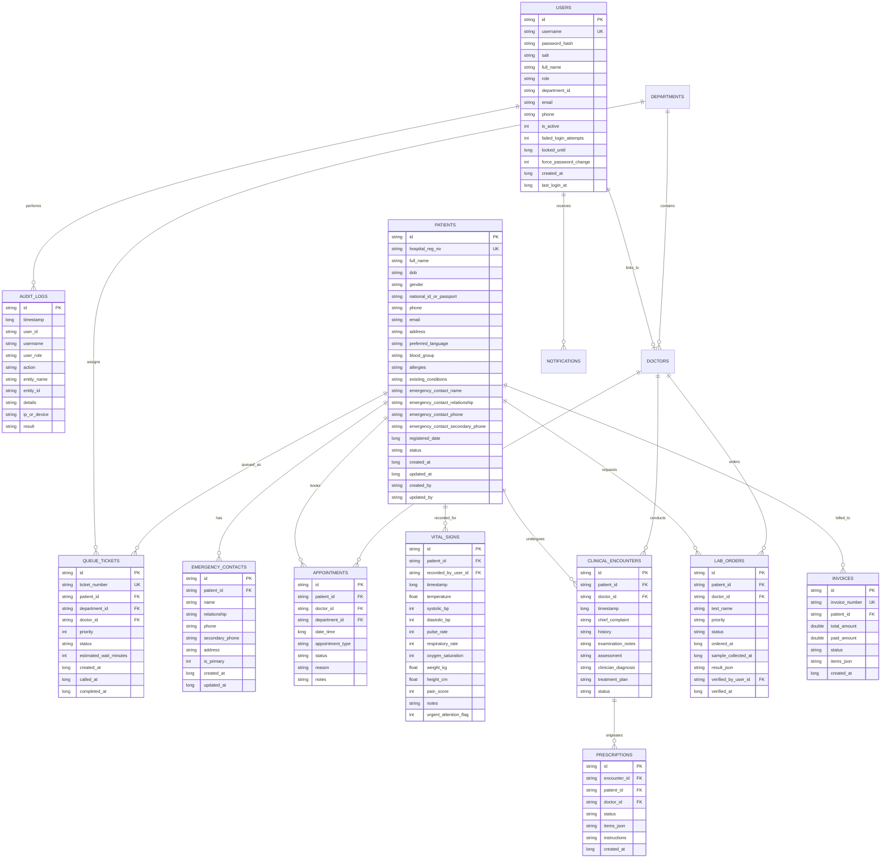

# CareFlow Database ER Model & Schema Specification

The CareFlow local database is designed in Room SQLite with primary keys, indexes, foreign keys, and audit timestamps (`created_at`, `updated_at`).

---

## 1. Relational Entities Diagram (Mermaid)

---

## 2. Status Transitions Engine

### Patient Master Record Lifecycle:
`ACTIVE` ➔ `INACTIVE` ➔ `ARCHIVED`  
*(Special terminal states: `DECEASED`, `TRANSFERRED`)*  
*Note: Hard deletion is prohibited in this demonstration environment. Archival requires `ARCHIVE_PATIENT` administrative authority.*

### Hospital Registration Number Standard:
* Format: `CF-YYYY-XXXXXX` (e.g. `CF-2026-000001`)
* Strategy: Sequential 6-digit zero-padded index per calendar year, decoupled from patient demographic names, indexed uniquely in Room SQLite.

### Queue Lifecycle:
`WAITING` ➔ `CALLED` ➔ `IN_CONSULTATION` ➔ `COMPLETED`  
*(Exceptions: `SKIPPED`, `CANCELLED`)*

### Appointment Lifecycle:
`REQUESTED` ➔ `CONFIRMED` ➔ `CHECKED_IN` ➔ `COMPLETED`  
*(Exceptions: `RESCHEDULED`, `CANCELLED`, `NO_SHOW`)*

### Prescription Lifecycle:
`DRAFT` ➔ `ISSUED` ➔ `DISPENSING` ➔ `DISPENSED`  
*(Exceptions: `PARTIALLY_DISPENSED`, `CANCELLED`)*

### Laboratory Order Lifecycle:
`REQUESTED` ➔ `SAMPLE_COLLECTED` ➔ `PROCESSING` ➔ `COMPLETED` ➔ `VERIFIED`  
*(Exception: `CANCELLED`)*

### Invoice Billing Lifecycle:
`PENDING` ➔ `PARTIALLY_PAID` ➔ `PAID`  
*(Exceptions: `CANCELLED`, `REFUNDED`)*
